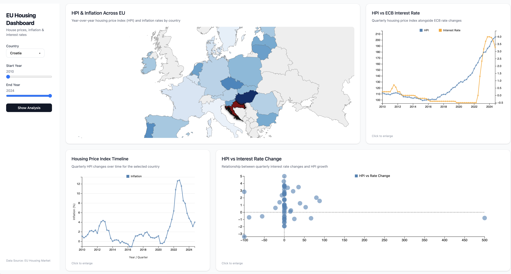
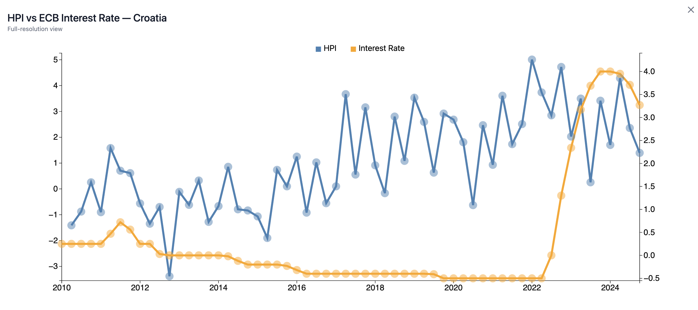
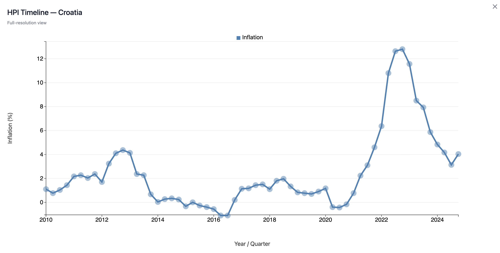
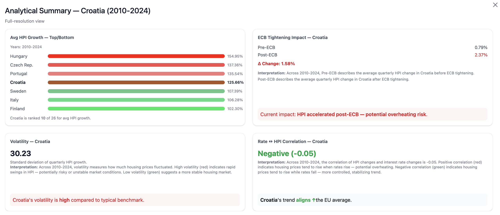

# EU Housing Market Visualization

An interactive dashboard for exploring housing prices across the European Union, highlighting the relationship between housing price dynamics, interest rates and macroeconomic indicators. Built entirely with React, TypeScript and D3.js, it provides insightful, interactive visualizations.

## Overview

This project offers an exploratory analysis of EU housing prices over the last decade. It enables users to investigate trends, structural changes after interest rate hikes, regional disparities and correlations with economic variables.

**Key questions addressed:**
- How have housing prices evolved across EU countries?
- What changes are visible after interest rates increased in 2022?
- Are trends consistent across regions or do disparities exist?
- How do interest rate changes correlate with housing price growth?

## Interactive Visualizations

| Visualization | Purpose |
|--------------|---------|
| Time-series Line Chart | Track quarterly Housing Price Index (HPI) trends per country |
| Dual-axis Line Chart | Compare HPI with ECB key interest rates |
| EU Choropleth Map | Visualize housing price and inflation growth across countries |
| Scatter Plot | Explore correlations between HPI growth and macroeconomic variables |

**Features:**
- Country and year range filtering
- Hovering for detailed values (tooltip)
- Brushing and coordinated updates
- Full-screen chart views
- Analytical summaries per country in sidebar

### Demo

#### Full dashboard display


#### Dual axis chart


#### Line chart


#### Scatter plot


#### Per country analysis dashboard


## Technologies Used

- **React + TypeScript** – Application logic and state management
- **D3.js** – Custom interactive visualizations
- **Tailwind CSS** – Responsive and modern styling
- **HTML5 & CSS3** – Structure and layout

All charts are custom-built using D3.js. No external visualization frameworks were used.

## Project Structure

```
eu-housing-prices-analysis/
├── assets/         
├── public/
|    ├── data/
|    │   ├── enriched/
|    │   ├── processed/
|    │   ├── raw/
|    │   ├── europe.json
├── scripts/
├── src/
│   ├── app/
│   |    ├── analysis/
│   |    ├── components/
│   |    ├── utils/
│   |    ├── App.tsx
│   ├── styles/
│   ├── main.tsx
└── index.html
└── LICENSE
└── package-lock.json
└── package.json
└── postcss.config.mjs
└── README.md
└── vite.config.ts
```

## Data Sources

- **House Price Index (HPI)** – [Eurostat](https://ec.europa.eu/eurostat/databrowser/product/view/tipsho40?lang=en)
- **ECB Key Interest Rates** – [Federal Reserve Bank of St. Louis
](https://fred.stlouisfed.org/series/ECBDFR)
- **Harmonised Index of Consumer Prices (HICP)** – [Eurostat](https://ec.europa.eu/eurostat/databrowser/view/prc_hicp_manr__custom_19638539/default/table)

**Data Processing:** All datasets are aligned to quarterly intervals for consistency across sources.

## Features & Functionality

- **Responsive Sidebar:** Country selector, year sliders and analytical summaries
- **Full Interactivity:** Hover, brush, filter and full-screen chart capabilities
- **Mobile Optimized:** Scrollable and resizable charts for smaller screens
- **Country-Specific Analysis:** Sidebar displays detailed metrics based on active filters

## Getting Started

### Prerequisites

- Node.js >= 16
- npm or yarn

### Installation

```bash
git clone https://github.com/ismiljanic/eu-housing-prices-analysis.git
cd eu-housing-prices-analysis
npm install
```

### Run Locally

```bash
npm run dev
```

Visit `http://localhost:5173` in your browser.

## Future Enhancements

- Add inflation vs HPI correlation analysis
- Implement animated time-lapse maps showing temporal evolution
- Enable export/download of charts as PNG or SVG
- Advanced filtering by region or EU economic clusters
- Dark mode toggle for dashboard
- Add comparison mode to overlay multiple countries simultaneously

## License

MIT License – see [LICENSE](LICENSE) for details.